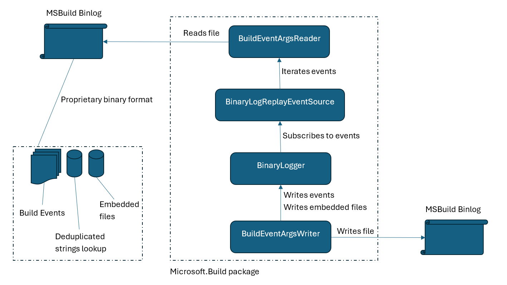

## Background
MSBuild binlog technical info: https://github.com/dotnet/msbuild/blob/main/documentation/wiki/Binary-Log.md

Since binlogs contain detailed build logs, they can happen to contain sensitive data - credentials, internal paths, sealed build environemnt details etc.
Being able to provide binlogs is vital for builds troubleshooting. For those reasons it may be helpful to be able to redact sensitive data from binlogs - before providing them for investigation, or before automatically publishing them as build artifacts.

## Cracking proprietary format
Rather then copying the internal implementation to the redacting tool, we want to reuse exposed reading/writing functionality.

Simplified overview of the MSBuild binlogs reading and writing functionality:



The important parts for us:
* Strings are deduplicated and stored separately. They are transparently added to the Build Events returned by the reader/event source
* Embedded files are transparently processed during shutdown of logging. Those files can (and usually do) contain textual data as well - those are not deduplicated.
* <a name="stamping"></a>Each produced binlog - including the replayed one - is stamped with runtime info (version, args) from the current run
* <a name="binary_inequality"></a>Binary logs were designed/tested for full reproducibility, but not necessarily for 1:1 binary equality (in some cases some empty structures can change to nulls etc.)
* The binlog file is a GZip archive

## Pluggable redaction

We want to be able to provide ability to leverage implementation (or composite of implementations) for an interface similar to:

```csharp
public interface ISensitiveDataProcessor
{
    /// <summary>
    /// Processes the given text and if needed, replaces sensitive data with a placeholder.
    /// </summary>
    string ReplaceSensitiveData(string text);
}
```

A simple implementation will be provided that is able to redact explicitly given string tokens.

Future versions may add automatic highly identifiable secrets redactions, user paths detection and redaction etc.

Future version might replace `string`s with `Span<char>`s for boosted performance. Support would however first need to be added to MSBuild binlog reading/writing modules, as otherwise we'd be actually hurting performance by the need to copy the internal buffers (as we'd need writable spans).

## Options of performing the redaction
We will not consider the option of copying and maintaining code interpreting the proprietary binlog format.

Redaction would be exposed as similar:

```csharp
public interface IBinlogProcessor
{
    /// <summary>
    /// Passes all string data from the input file to the <see cref="ISensitiveDataProcessor"/> and writes the
    /// resulting binlog file so that only the appropriate textual data is altered, while result is still valid binlog.
    /// </summary>
    Task<BinlogRedactorErrorCode> ProcessBinlog(
        string inputFileName,
        string outputFileName,
        ISensitiveDataProcessor sensitiveDataProcessor,
        CancellationToken cancellationToken);
}
```

### A) Running replay and editing data during replay
For this option we'll need Microsoft.Build package to expose ability to inject strings replacing as they are read. Reader would then be further passing properly redacted data and those can be pumped through binlog replaying/writing pipeline.

Advantages:
* Easier for maintance (minimal exposure to the binlog format)

Disadvantages:
* Requires serialization/deserialization of all events and writing new log in full even if no redactions happens during the process
* Relies on Replay functionality not to change data on binary level  - some [current limitations](#binary_inequality) will need to be resolved first, and [stamping of replay time data](#stamping) needs to be opt-out-able.

### B) Wrapping and splitting the binlog reading stream
For this option we'll need Microsoft.Build package to expose indications of start and end of reading of any data that might need redaction (deduplicated strings, embadded files). We'd pass wrapped `Stream` to the `BuildEventArgsReader`. Wrapper would be copying the input stream to output stream, redirectiong portion of writes that require redaction.

Advantages:
* Input binlog neads to be just read/deseriaized by the MSBuild code - no serialization is performed.
* We can delay copying to output stream until we hit first data that are actually redacted.
* [Binary inequalities](#binary_inequality) occuring during events deserialization->serialization do not apply to this approach.

Disadvantages:
* Higher implementation and maintanance cost - the logic need to mainly be aware and properly handle the archive format of the binlogs (which is technically implementation detail of binlogs).

### Summary

* Both options will need adjustments/exposing in the MSBuild binlog reading/writing API - we might want to define and expose those upfront (to be able to deffer the decision or allow for alternative implementations)
* Second option brings mainly possible performance benefit at the cost of implementation complexity. In order to speed up the creation/piloting/feedback-collection of first prototype, we decided for the first option.